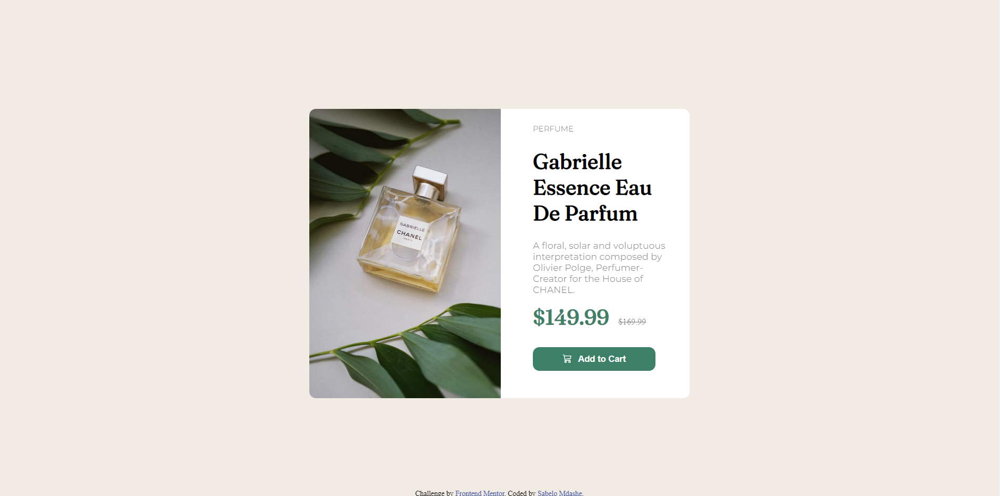

# Frontend Mentor - Product preview card component solution

This is a solution to the [Product preview card component challenge on Frontend Mentor](https://www.frontendmentor.io/challenges/product-preview-card-component-GO7UmttRfa). Frontend Mentor challenges help you improve your coding skills by building realistic projects. 

## Table of contents

- [Overview](#overview)
  - [The challenge](#the-challenge)
  - [Screenshot](#screenshot)
  - [Links](#links)
- [My process](#my-process)
  - [Built with](#built-with)
  - [Continued development](#continued-development)
  - [Useful resources](#useful-resources)
- [Author](#author)

**Note: Delete this note and update the table of contents based on what sections you keep.**

## Overview

### The challenge

Users should be able to:

- View the optimal layout depending on their device's screen size
- See hover and focus states for interactive elements

### Screenshot

### Links

- Solution URL: (https://www.frontendmentor.io/solutions/product-preview-card-component-69amT6W7vx)
- Netlify URL: (https://lucky-buttercream-dcdff3.netlify.app/)

## My process

### Built with

- Semantic HTML5 markup
- CSS custom properties
- Flexbox
- Mobile-first workflow
- Bootstrap Icons

### Continued development

I want to improve my CSS skills.

### Useful resources

- [Bootstrap Icons](https://icons.getbootstrap.com/) - This helped me to get the cart icon.

## Author

- Website - [Sabelo Mdashe](http://sabelomdashe.co.za)
- Frontend Mentor - [@Sabelo-Mdashe](https://www.frontendmentor.io/profile/Sabelo-Mdashe)
- Github - [@Sabelo-Mdashe](https://github.com/Sabelo-Mdashe)